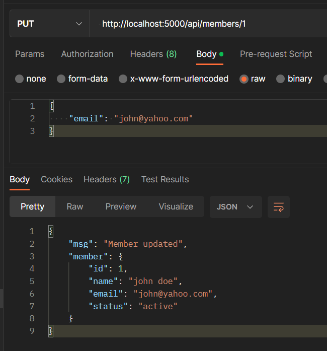
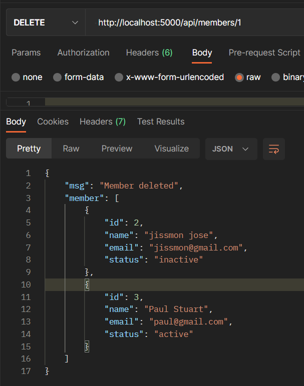

# Express.js-Crash-Course

**Tutorial Link:** https://www.youtube.com/watch?v=L72fhGm1tfE&t=3354s

[why use express](#why-use-express)

[basic server syntax](#basic-server-syntax)

[Middleware](#middleware)

[Working with express](#working-with-express)

[Install Nodemon](#install-nodemon)

[Sending Files using static function](#sending-files-using-static-function)

[Middlewares](#middlewares)

[Get all members](#get-all-members)

[Get single member](#get-single-member)

[Create New Member](#create-new-member)

[Update a Member](#update-a-member)

[Delete a Member](#delete-a-member)

[Rendering Templates using template engine](#rendering-templates-using-template-engine)

[Forms](#forms)

https://www.youtube.com/watch?v=L72fhGm1tfE&t=3354s

- Express is a fast, basic and minimalist web framework for node.js

- A server-side or backend framework. used in combination with react, angular, vue to build full stack apps.


## why use express

- build apps with nodejs easier.
- used for both server rendered apps as API/microservices.
- extremely light.
- full control of request and responses.
- greaT to use with client side frameworks.

## basic server syntax
s
```js
// import express
const express = require('express')

// initialize express
const app = express()

// create your endpoints/route handlers
app.get('/', (req, res) => {
    res.send('hello')
})

// listen to port
app.lsiten(5000)
```

## Middleware

- Middleware functions have access to request and response object.
- Express has built in middleware.
- We can use custom middlewares as well.
- Middleware make changes to request/response cycles.
- Can end response cycle.
- Call next middleware in the stack.


## Working with express

```bash
npm init -y
npm i express
```

```JS
const express = require('express')

const app = express()

const PORT = process.env.PORT || 5000

app.listen(PORT, ()=>console.log(`Server runs on port ${PORT}`));
```

```BASH
node index.js
```

## Get Request

```js
app.get('/', (req, res) => {
    res.send(
        '<h1>Hello Express</h1>'
    )
})
```

## Install Nodemon

```bash
npm i -D nodemon
```

Update the script in package.json

```json
 "scripts": {
    "start": "node index",
    "dev": "nodemon index"
  },
```

## Sending Files using static function

- Create a public folder
- Add files into it.

```js
app.use(express.static(path.join(__dirname, 'public')))
```


- We add css files into public folder.


### Get Request

```js
// get all members
app.get('/api/members', (req, res) => res.json(members))
```

## Middlewares

- middlewares are the function that have access to request and response cycle.


### Creating a middleware function

```js
const logger = (req,res,next)=>{
    console.log('Hello')
    next();
}

// Initialize Middleware
app.use(logger )
```

- Always call `next` in a middleware, so we can move to next middleware.
- Initialize the middlware.
- Everytime we sent the request, middleware runs.

- Put middlware in a seperate folder called `middlewares`

## Get all members

```js
// get all members
router.get('/api/members', (req, res) => res.json(members))
```


## Get single member

```js
app.get('/api/member/:id', (req,res)=>{
    // check whether member exists or not
    const found = members.some(member=>member.id===parseInt(req.params.id))

    if (found) {    
        res.json(members.filter(member => member.id === parseInt(req.params.id)))   
    } else {
        // return error if not found
        res.status(400).json({
            msg: "Member not found"
        })
    }
})
```

- Create a folder for routes.
- Create a file to contain routes related to a Members.

**Members.js**

```js
const { Router } = require('express');
const express = require('express')
const router = express.Router();
const members = require('../../members');


// get all members
router.get('/api/members', (req, res) => res.json(members))

 
// get single member
router.get('/api/member/:id', (req,res)=>{
    const found = members.some(member=>member.id===parseInt(req.params.id))

    if (found) {    
        res.json(members.filter(member => member.id === parseInt(req.params.id)))   
    } else {
        res.status(400).json({
            msg: `Member with id ${req.params.id} not found`
        })
    }
});

module.exports = Router
```

**index.js**

```js
// access routes
app.use('api/members', require('./routes/api/members'))
```

## Create New Member

- Use Bodyparser to parse request body.
- Handle url encoded data.

```js
// bodyparser middleware
app.use(express.json())

// handle url encoded data
app.use(express.urlencoded({"extended": false}))
```


- Install `uuid` to generate random id for our member.

```bash
npm i uuid
```

**members.js**

```js

// create a member
router.post('/', (req, res) => {
    const newMamber = {
        id: uuid.v4(),
        name: req.body.name,
        email: req.body.email,
        status: 'active'
    }
    if (!newMamber.name
        || !newMamber.email) {
            return res.status(400).json({
                msg: 'please include a name and email'
            })
    } 

    members.push(newMamber)
    res.json(members)
})
```

## Update a Member

```js
// Update a member
router.put('/:id', (req, res) => {
    const found = members.some(member=>member.id===parseInt(req.params.id));

    if (found) {
        const updatedMember = req.body;
        members.forEach(member=>{
            if (member.id===parseInt(req.params.id)) {
              member.name = updatedMember.name ? updatedMember.name : member.name;
              member.email = updatedMember.email ? updatedMember.email: member.email

              res.json({
                msg: 'Member updated', member
              })
            }
        })
    } else {
        res.status(400).json(
            {
                msg: `No member with id of ${req.params.id}`
            }
        )
    }  
})
```

### Postman API Call




## Delete a Member

```js
router.delete('/:id', (req, res) => {
    const found = members.some(member=>member.id===parseInt(req.params.id));
    if (found) {
        res.json({
        msg: 'Member deleted', 
        member: members.filter(member=>member.  id!==parseInt(req.params.id))
        })
    }
    else {
        res.status(400).json(
        {
            msg: `No member with id of ${req.params.id}`
        }
    )
}  
});
```

### Postman API Call




## Rendering Templates using template engine

Install express handlebars

```bash
npm i express-handlebars
```

```js
const exphbs = require('express-handlebars');
// Handlebars Middlware
app.engine('handlebars', {
    defaultLayout: 'main'
});
app.set('view engine', 'handlebars');
app.set('views', './views');
```

- Create a `views` folder.
- Create a `layouts` folder inside our `views` folder.

### Output the views

**views\layouts\main.handlebars**

```html
<!DOCTYPE html>
<html lang="en">
<head>
    <meta charset="UTF-8">
    <meta http-equiv="X-UA-Compatible" content="IE=edge">
    <meta name="viewport" content="width=device-width, initial-scale=1.0">
    <link rel="stylesheet" href="https://cdn.jsdelivr.net/npm/bootstrap@5.2.3/dist/css/bootstrap.min.css" integrity="sha384-rbsA2VBKQhggwzxH7pPCaAqO46MgnOM80zW1RWuH61DGLwZJEdK2Kadq2F9CUG65" crossorigin="anonymous">
    <title>Members App</title>
</head>
<body>
    <div class="container mt-4">
        {{{body}}}
    </div>
</body>
</html>
```

### Create view for index page

**views\index.handlebars**

```html
<h1>Members</h1>
```

### Create a route for index view

**index.js**
```js
// Homepage route
app.get('/', (req, res)=>res.render('index'))
```

### Render the contents in template

**views\index.handlebars**

```html
<h1 class="text-center mb-3">{{title}}</h1>
<h4>Members</h4>
<ul class="list-group">
    <!-- loop though each member -->
    {{#each members}}
        <li class="list-group-item">
            {{this.name}}: {{this.email}}
        </li>
    {{/each}}
</ul>
```

- Update the route

**index.js**

```js
// Homepage route
app.get('/', (req, res)=>res.render('index', {
    title: 'Member App',
    members
}));
```

## Forms

### Create a form to add new member

```html
<h1 class="text-center mb-3">{{title}}</h1>
<form action="/api/members" method="post" class="mb-4">
    <div class="form-group">
        <label for="name">Name</label>
        <input type="text" name="name" id="" class="form-control">
    </div>
    <div class="form-group mt-3">
        <label for="email">Email</label>
        <input type="text" name="email" id=""
        class="form-control"
        >
    </div>
    <input type="submit" value="Add Member" class="btn btn-primary btn-block mt-3">
</form>
<h4>Members</h4>
<ul class="list-group">
    {{#each members}}
        <li class="list-group-item">
            {{this.name}}: {{this.email}}
        </li>
    {{/each}}
</ul>
```

### Redirect to home page after adding a member

```js
router.post('/', (req, res) => {
    const newMamber = {
        id: uuid.v4(),
        name: req.body.name,
        email: req.body.email,
        status: 'active'
    }
    if (!newMamber.name
        || !newMamber.email) {
            return res.status(400).json({
                msg: 'please include a name and email'
            })
    } 
    
    members.push(newMamber)
    res.redirect('/')
})
```


